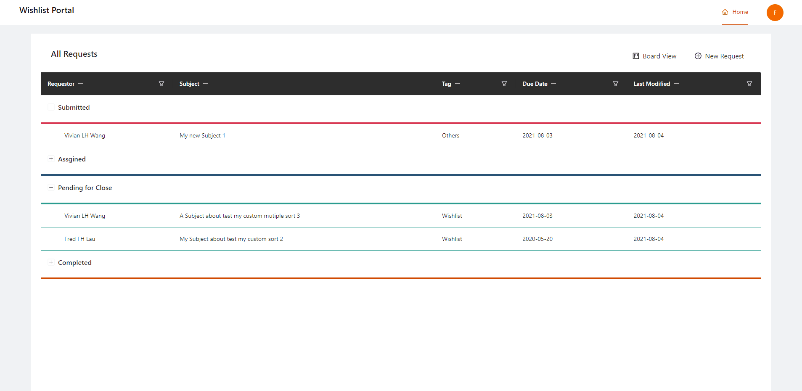

# Getting Started with Create React App

# my-secret-project-3-backendServer
with mongoDB atlas

1. Install Dependencies

```npm i```

2. Start frontend server

```npm start```

3. API Port: 3001
http://localhost:3001/


Feature:
1. Kanban View


2. New Request


3. ListView, Sorter and Filter


4. Update information in List View or Kanban View

